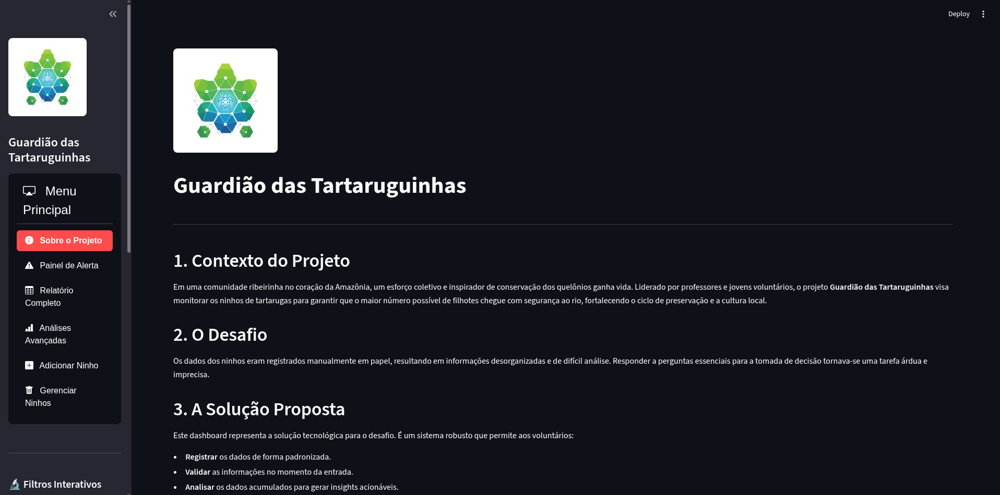
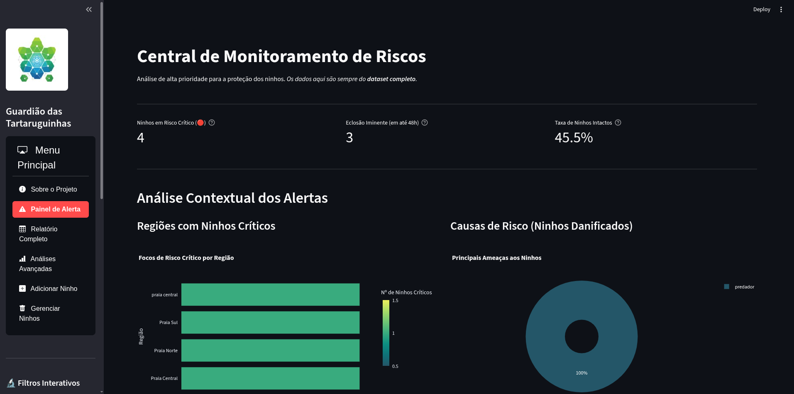
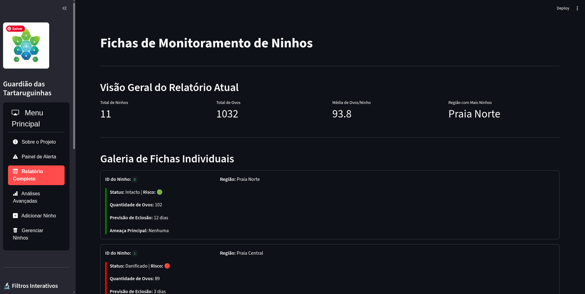
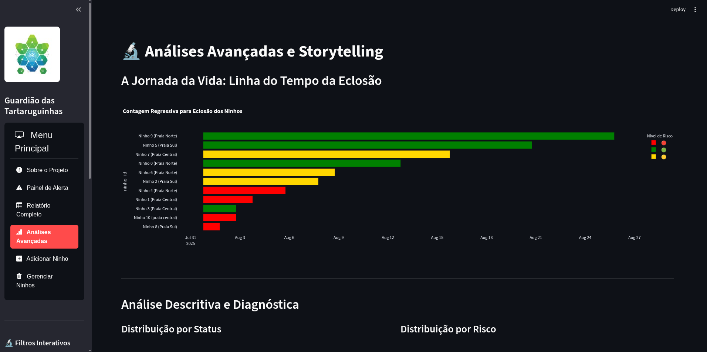
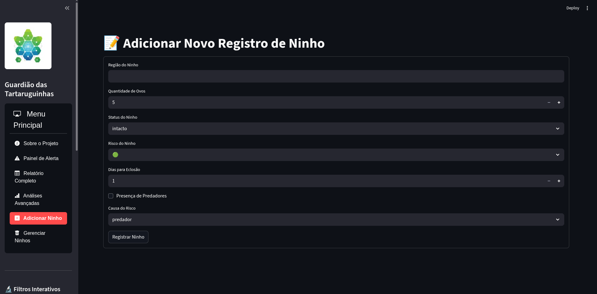
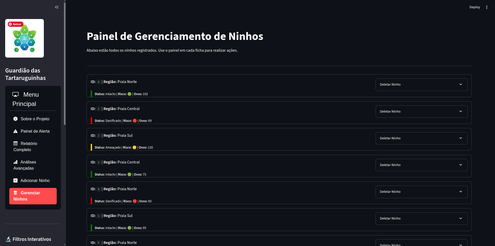

<<<<<<< HEAD
# Guardião das Tartaruguinhas - v2.0
=======
>>>>>>> 0899dccff3e8de096c8c4803979b56e6aea96b02
🐢 Guardião das Tartaruguinhas

**Um sistema de monitoramento comunitário de ninhos de quelônios, desenvolvido como projeto para o curso de IA Aplicada aos Desafios Socioambientais da Amazônia (I2A2).**

---

## 📜 Sobre o Projeto

Este projeto nasceu da necessidade de uma comunidade ribeirinha na Amazônia de digitalizar e organizar os dados coletados manualmente sobre ninhos de tartarugas. O objetivo é transformar dados brutos em insights acionáveis para otimizar os esforços de conservação, garantindo que mais filhotes cheguem com segurança ao rio.

<<<<<<< HEAD
Bem-vindo à versão 2.0 do **Guardião das Tartaruguinhas**, um dashboard de monitoramento de ninhos de quelônios na Amazônia, reimaginado para oferecer uma experiência de análise de dados mais rica, intuitiva e visualmente impactante.

Este projeto transforma dados brutos de conservação em insights acionáveis, utilizando o poder do Streamlit para criar uma ferramenta que não apenas informa, mas também engaja e capacita os voluntários em campo.

## ✨ Principais Funcionalidades da v2.0

A evolução do dashboard focou em quatro pilares de aprimoramento cognitivo e visual:

1.  **Navegação Moderna:** Um menu lateral com ícones substitui a antiga seleção, tornando a navegação mais rápida e intuitiva.
2.  **Central de Monitoramento de Riscos:** O antigo "Painel de Alerta" foi transformado em um cockpit de ação, com métricas claras e gráficos contextuais que direcionam a atenção para os pontos mais críticos.
3.  **Fichas de Monitoramento:** O relatório de dados brutos deu lugar a uma galeria de "cards" individuais para cada ninho, facilitando a consulta e a avaliação visual rápida.
4.  **Storytelling Visual:** Uma linha do tempo interativa na página de análises conta a história da jornada de cada ninho até a eclosão, transformando dados temporais em uma narrativa poderosa.

## 📸 Screenshots da Nova Interface

| Central de Monitoramento de Riscos | Fichas de Monitoramento |
| :---: | :---: |
|  |  |

| Análises Avançadas e Linha do Tempo | Painel de Gerenciamento Interativo |
| :---: | :---: |
|  |  |

| Filtros Interativos | Formulário de Adição |
| :---: | :---: |
|  |  |

## 🚀 Como Executar o Projeto

Siga os passos abaixo para configurar e rodar o dashboard em seu ambiente local.

### 1. Pré-requisitos

- Python 3.8+
- `pip` e `venv`

### 2. Configuração do Ambiente

É uma boa prática usar um ambiente virtual para isolar as dependências do projeto.

**Crie e ative o ambiente virtual:**

```bash
# Crie o ambiente
python -m venv venv

# Ative no macOS/Linux
source venv/bin/activate

# (ou) Ative no Windows
.\venv\Scripts\activate
```

### 3. Instale as Dependências

Com o ambiente virtual ativado, instale as bibliotecas necessárias:

```bash
pip install -r requirements.txt
```

### 4. Execute o Dashboard

Para iniciar a aplicação web interativa, execute o comando:

```bash
streamlit run dashboard.py
```

O Streamlit iniciará um servidor local e abrirá o dashboard no seu navegador padrão.

## 🛠️ Desenvolvido com

*   **Python:** A linguagem por trás de toda a lógica.
*   **Streamlit:** O framework que dá vida à interface web interativa.
*   **Pandas:** Para a manipulação e análise dos dados.
*   **Plotly:** Para a criação dos gráficos ricos e interativos.
*   **streamlit-option-menu:** Para o menu de navegação moderno.
=======
A solução é um sistema interativo via terminal, escrito em Python puro, que permite aos voluntários registrar, visualizar e analisar os dados de monitoramento de forma eficiente e padronizada.

## ✨ Funcionalidades

O repositório contém duas versões do sistema:

1.  **`guardiao_mvp.py` (Produto Mínimo Viável):**
    * **Cadastro de Ninhos:** Interface para inserção de novos dados com validação robusta.
    * **Relatório Completo:** Exibição de todos os ninhos registrados em formato de tabela.
    * **Estatísticas Básicas:** Cálculo de KPIs essenciais para o monitoramento.

2.  **`guardiao_avancado.py` (Versão de Análise Avançada):**
    * **Todas as funcionalidades do MVP.**
    * **Design de UX Aprimorado:** Interface com cores, ícones e divisores temáticos para uma melhor experiência do usuário.
    * **Painel de Alerta Rápido:** Um dashboard com os indicadores mais críticos para tomada de decisão imediata.
    * **Análise Descritiva Completa:** Inclui estatísticas detalhadas e gráficos de barras textuais.
    * **Análise Diagnóstica:** Funções que cruzam dados para encontrar causas e correlações (ex: principal causa de danos, impacto de predadores).

## 🚀 Como Executar

1.  Certifique-se de ter o Python 3 instalado em sua máquina.
2.  Clone o repositório:
    ```bash
    git clone [https://github.com/enps2015/guardiao-das-tartaruguinhas.git](https://github.com/enps2015/guardiao-das-tartaruguinhas.git)
    ```
3.  Navegue até o diretório do projeto:
    ```bash
    cd guardiao-das-tartaruguinhas
    ```
4.  Execute a versão desejada no seu terminal:
    ```bash
    # Para a versão MVP
    python guardiao_mvp.py

    # Para a versão avançada
    python guardiao_avancado.py
    ```

## 🛠️ Tecnologias Utilizadas

* **Python 3:** A única linguagem utilizada, sem a necessidade de bibliotecas externas, focando nos fundamentos da programação.

---
_Este projeto representa a ponte entre o conhecimento tradicional e a tecnologia acessível, transformando dados em um escudo para a biodiversidade amazônica._

**Desenvolvido com paixão e a Força dos Dados por:**

**Eric Pimentel**

[](https://www.linkedin.com/in/eric-np-santos/)
[](https://github.com/enps2015)
[](https://www.instagram.com/eric.n.pimentel/)
[](mailto:enps2006@gmail.com)

---

*✨ Última atualização: 30 de Julho de 2025 ✨*
>>>>>>> 0899dccff3e8de096c8c4803979b56e6aea96b02

